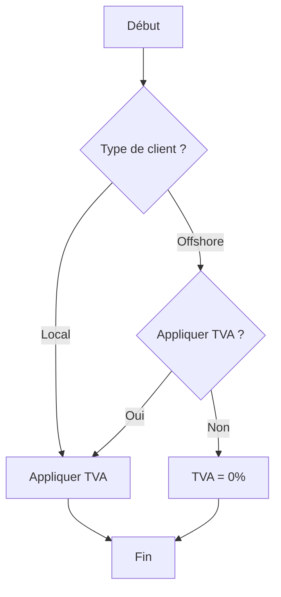

# Cycle de vie d'un Feature

## Etapes

Documentation & diagramme → Spécification → Plan → Tests → Développement → Test fonctionnel → Documentation & changelog → Revue → Merge

### pourquoi et comment :

1. **Documentation & diagramme**

Pourquoi : pour visualiser clairement le workflow et éviter les ambiguïtés.

Comment : créer un schéma (Mermaid, diagramme de flux) et rédiger la description métier.

2. **_Spécification_**

Pourquoi : pour traduire le diagramme en règles exactes exploitables par le code.

Comment : définir conditions, valeurs par défaut, exceptions, et sorties attendues.

3. **Plan**

Pourquoi : pour organiser le développement et choisir la structure du code.

Comment : décider des composants, fonctions, méthodes et interactions front/backend.

4. **Tests (pré-codage / TDD)**

Pourquoi : pour s’assurer que toutes les règles métier sont testables et correctes.

Comment : écrire des tests unitaires simulant tous les scénarios possibles du workflow.

5. **Développement**

Pourquoi : pour transformer la spécification en fonctionnalité opérationnelle.

Comment : coder le backend (calculs) et le frontend (formulaires et affichage).

6. **Test fonctionnel**

Pourquoi : pour valider le comportement réel du système selon le workflow.

Comment : exécuter toutes les combinaisons de scénarios et vérifier les résultats.

7. **Documentation & changelog**

Pourquoi : pour garder une trace claire des fonctionnalités et changements pour l’équipe.

Comment : commenter le code et mettre à jour CHANGELOG.md avec les ajouts et corrections.

8. **Revue**

Pourquoi : pour détecter les erreurs, incohérences ou améliorations avant fusion.

Comment : effectuer une Pull Request et faire relire le code et les tests par un pair.

9. **Merge**

Pourquoi : pour intégrer la fonctionnalité stable dans la branche principale.

Comment : fusionner la branche feature dans main ou develop après validation de la revue.


## Checklist Développement

### Pré-développement
- [ ] **Documentation & diagramme**  
  Schéma du workflow créé et description métier rédigée.

- [ ] **Spécification**  
  Règles métier clairement définies : conditions, valeurs par défaut, exceptions, sorties attendues.

- [ ] **Plan**  
  Architecture choisie : fonctions, composants, interactions front/backend.

### Avant codage
- [ ] **Tests (pré-codage / TDD)**  
  Scénarios définis et tests unitaires préparés pour tous les cas du workflow.

### Développement
- [ ] **Développement**  
  Backend et frontend codés selon la spécification.

### Validation
- [ ] **Test fonctionnel**  
  Tous les scénarios du workflow vérifiés et validés.

### Post-développement
- [ ] **Documentation & changelog**  
  Code commenté, `CHANGELOG.md` mis à jour avec ajout ou correction.

- [ ] **Revue**  
  Pull Request créée et revue par un pair pour valider logique et tests.

- [ ] **Merge**  
  Branch feature fusionnée dans `main` ou `develop` après validation.


## Astuces pratiques pour VS Code

- Crée un fichier `TEMPLATE_PR.md` et colle cette checklist.
- Lors d’une nouvelle PR, ouvre ce fichier, copie la checklist et colle-la dans le corps de la PR.
- Chaque case [ ] peut être cochée [x] au fur et à mesure dans GitHub ou GitLab.


Checklist de développement avec exemples

## Checklist Développement – Exemple TVA Facture
Exemple de checklist avec **exemples simples** te donne un **point de départ fonctionnel** que tu peux directement adapter pour ton projet Git et VS Code.  

### Pré-développement
[ ] **Documentation & diagramme**  
  Exemple : créer un diagramme Mermaid montrant le choix du client local/offshore et l’application de la TVA.



[ ] Spécification

Exemple :

- Si client = local → TVA = 19%
- Si client = offshore et TVA appliquée → TVA = 0%
- Sortie : montant total TTC

[ ] Plan

Exemple :
- Backend : fonction calculateTotal(clientType, applyVAT)
- Frontend : formulaire avec sélection du type de client et case à cocher TVA

1. Avant codage

- Tests (pré-codage / TDD)

Exemple :
```python
assert calculateTotal("local", True) == 119
assert calculateTotal("offshore", True) == 0
assert calculateTotal("offshore", False) == 0
```

2. Développement

Exemple : coder la fonction `calculateTotal()` et le formulaire simple pour choisir le type de client.

[ ] Validation : Test fonctionnel

Exemple : créer une facture test pour chaque scénario :

- Client local → vérifier TTC
- Client offshore → TVA appliquée → vérifier TTC
- Client offshore → TVA non appliquée → vérifier HT

3. Post-développement

[ ] Documentation & changelog

Exemple :
```md
## [Unreleased]
### Added
- Fonction `calculateTotal()` pour gestion TVA local/offshore
- Formulaire frontend pour sélection du type de client et TVA
```

[ ] Revue

Exemple : PR ouverte et relue par un collègue pour valider la logique et les tests.

[ ] Merge

Exemple : fusion de la branche feature/facturation-tva dans develop après approbation de la PR.